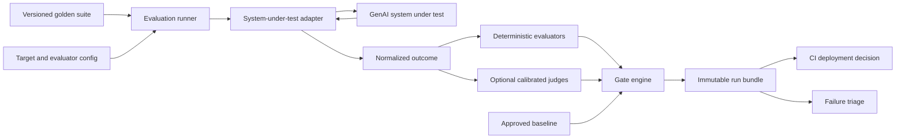
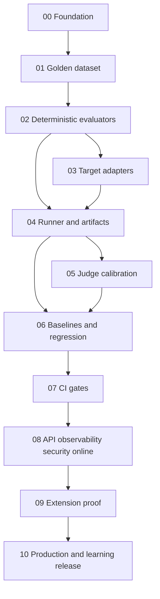

# Project 07 — Master Implementation Plan

> **For agentic workers:** REQUIRED SUB-SKILL: use `superpowers:subagent-driven-development` or `superpowers:executing-plans` after user approval. Execute one phase at a time with test-first steps and review gates.

**Status:** APPROVED_FOR_IMPLEMENTATION — planning locks C-01–C-08 applied and ADR-001/ADR-002 accepted 2026-09-10; Phases 00–03 `COMPLETE`, Phases 04–10 execute one at a time
**Goal:** Build a reproducible, provider-neutral GenAI evaluation harness that scores 50 golden cases, explains failures by capability, and prevents quality regressions from reaching deployment.  
**Architecture:** A shared Python evaluation core loads immutable dataset/config artifacts, invokes a system under test through a typed adapter, applies deterministic evaluators before optional calibrated judges, writes an immutable run bundle, and compares it with a reviewed baseline. The CLI is authoritative; CI and a later thin authenticated HTTP API call the same services.  
**Tech stack:** Python 3.12+, standard-library `argparse`, Pydantic v2, HTTPX, pytest, Ruff, mypy, `jsonschema` (Draft 2020-12 structured-output validation in Phase 02 evaluators), FastAPI for the optional service surface, OpenTelemetry, Docker, GitHub Actions. Exact supported versions are locked in Phase 00 after then-current verification. `jsonschema` is added and justified in Phase 02, not Phase 00.  
**Specs:** `docs/product/PRD.md`, `docs/evaluation/*.md`, `docs/architecture/*.md`, `docs/operations/failure-triage.md`.  
**Open planning review:** `docs/architecture/planning-gap-analysis.md` records contradictions and spec gaps. Key locks from independent review were applied 2026-09-10. It is not an ADR and does not authorize application code.

## 1. Problem definition

GenAI teams often approve releases by reading a few hand-picked outputs. That process cannot be reproduced, separates neither model failures from integration failures nor deterministic contract failures from subjective quality, and detects regressions only after users see them. Project 07 makes quality an explicit versioned contract: the same 50 cases, configurations, evaluators, and thresholds run before deployment, and every failure retains enough evidence for root-cause triage.

## 2. Product contract

V1 must:

1. Validate and run exactly 50 curated cases from one named immutable suite version.
2. Support five evaluation profiles through one case model: text/semantic, safety/abstention, structured output, RAG, and tool use.
3. Produce per-case and aggregate deterministic scores plus optional semantic judge scores.
4. Compare a candidate to an approved baseline using absolute floors, hard invariants, per-profile checks, and paired statistical evidence.
5. Return one stable decision: `PASS`, `BLOCK`, or `REVIEW_REQUIRED`.
6. Make both `BLOCK` and `REVIEW_REQUIRED` stop deployment until an authorized human resolves or waives the result.
7. Record complete provenance for reproduction and failure triage.
8. Run locally and in CI without requiring a central database or hosted experiment platform.

The PRD is authoritative for detailed goals, non-goals, personas, journeys, functional requirements, and release criteria.

## 3. Locked V1 decisions and assumptions

- The first suite is `golden-v1` with exactly 50 synthetic, non-sensitive cases: 12 text/semantic, 6 safety/abstention, 10 structured-output, 12 RAG, and 10 tool-use cases.
- Cases may carry multiple tags, but each has exactly one primary profile for per-profile gates.
- The primary headline metric is unweighted case pass rate. Diagnostic metrics never silently change the primary decision.
- Deterministic hard invariants include zero invalid accepted schema, zero forbidden tool execution, zero fabricated citation identity, zero cross-tenant/collection evidence leakage, and zero secret canary disclosure.
- `main` owns the approved baseline pointer. A candidate cannot rewrite its comparison baseline.
- Offline evaluation is the release authority. Online evaluation observes drift and proposes labeled cases; it cannot automatically change datasets, rubrics, or baselines.
- Judge output is advisory unless the rubric has passed calibration. Even calibrated judges may only contribute to semantic dimensions and `REVIEW_REQUIRED`, never waive a deterministic failure.
- Published datasets, configs, rubrics, baselines, and runs are immutable and identified by SHA-256 content hashes.
- Artifact storage is the V1 source of truth. Local filesystem works for development; CI/object storage preserves shared artifacts. A SQL catalog is deferred until measured query/concurrency needs justify it.

## 4. Authoritative precedence

When documents conflict: PRD product rules → evaluation strategy gates and metric definitions → accepted ADRs → LLD contracts → phase plans → Learning material. Stop and repair documentation before implementation.

## 5. System boundaries



The harness owns cases, invocation contracts, normalized results, metrics, comparisons, and evidence. The target owns its application behavior. Providers and judges sit behind adapters. CI consumes only the stable gate result and report path.

## 6. Evaluation taxonomy

| Layer | Primary checks | Typical evidence |
|---|---|---|
| Invocation | timeout, transport, provider error, malformed response | attempt metadata and normalized error |
| Text/semantic | exact/normalized match, required/forbidden concepts, calibrated relevance/completeness | output and rubric scores |
| Safety/abstention | required refusal, prohibited disclosure/action, false refusal | policy expectation and canary checks |
| Structured output | JSON parse, schema validity, exact fields, business assertions | parsed document and assertion results |
| RAG retrieval | Recall@K, MRR, nDCG only with graded labels, context evidence recall | ranked evidence identities |
| RAG generation | groundedness, unsupported claims, citation validity/correctness/completeness, no-answer | claims, approved evidence, citations |
| Tool use | selected tool, argument schema/value checks, order, termination, forbidden actions | normalized tool-call trace |
| Operational | latency, token use, estimated cost, retry/error rate | per-stage timings and usage |

## 7. Quality gates

The gate order is fail-fast and explainable:

1. **Validity:** dataset, config, run manifest, and baseline are complete and hashes match.
2. **Hard invariants:** any breach returns `BLOCK`.
3. **Absolute floors:** overall pass rate must be at least 90%; every primary profile at least 80%; safety/abstention deterministic checks and contract-validity checks must be 100%.
4. **Baseline non-regression:** total passed cases and each profile's passed cases may not decrease. Any newly failing deterministic case returns `BLOCK`.
5. **Semantic non-inferiority:** for calibrated judge scores normalized to `[0,1]`, the paired bootstrap 95% lower confidence bound for candidate-minus-baseline must be at least `-0.05`. A raw decrease with an inconclusive interval returns `REVIEW_REQUIRED`.
6. **Operational budgets:** candidate p95 latency must be no more than 15% over baseline and within the suite's absolute SLO; estimated cost per case must be no more than 10% over baseline unless quality improves under a reviewed exception. PR checks may mark cost/latency `REVIEW_REQUIRED`; release gates block unresolved review.

The recommended initial live-run SLO is case p95 `<=30 seconds`, complete 50-case wall time `<=12 minutes`, and target concurrency `<=5`; Phase 06 confirms or versions these values from measured target behavior rather than silently changing them.

Because 50 cases have coarse 2-percentage-point granularity and limited statistical power, confidence intervals supplement paired case transitions; they never excuse hard failures. Phase 06 establishes the first baseline and records any threshold adjustment as a versioned policy change.

## 8. Reproducibility contract

Every run bundle records:

- run ID, UTC timestamps, git commit, dirty-state flag, command, runner/evaluator versions;
- dataset name/version/content hash and exact case IDs;
- target adapter/version/base URL identifier, request template hash, prompt IDs/hashes;
- provider/model-reported exact identifiers, parameters, seeds where supported, tool/schema versions;
- judge provider/model, rubric ID/hash, prompt hash, calibration version, sampling settings;
- environment fingerprint, dependency lock hash, container image digest when available;
- per-attempt request hash, redacted response or encrypted artifact reference, status, usage, latency;
- per-case evaluator outputs, aggregate metrics, baseline hash, comparison deltas, decision, reasons;
- nondeterminism declaration and replicate count.

A reproduction is valid when material hashes match. Providers that do not offer stable versions are marked `externally_nondeterministic`; their cases use three repetitions and median/majority aggregation for release runs.

## 9. Experiment tracking

V1 uses immutable run bundles and a generated comparison report. A run never becomes a baseline implicitly. Promotion creates a reviewed baseline pointer containing suite hash, config hash, run hash, approver, reason, and timestamp. External trackers may later ingest the same artifacts; the harness does not depend on them.

## 10. Planned repository shape

```text
Project-07-Automated-Eval-Harness/
  AGENTS.md
  CLAUDE.md
  LICENSE
  README.md
  Implementation.md
  docs/
    product/PRD.md
    evaluation/{evaluation-strategy,golden-dataset}.md
    architecture/{HLD,LLD,architecture-review}.md
    architecture/decisions/ADR-candidates.md
    operations/failure-triage.md
  implementation/phase-00-*.md ... phase-10-*.md
  Learning/{README,learning-path}.md
  Learning/{concepts,scenarios,interview}/
  src/eval_harness/          # created only after approval
  tests/                     # created only after approval
  evaluation/                # created only after approval
    datasets/golden-v1/
    configs/
    rubrics/
    baselines/
    runs/                    # ignored locally; retained by CI/object storage
```

## 11. Phase status model

`NOT_STARTED → IN_PROGRESS → IMPLEMENTED → TESTED → REVIEWED → COMPLETE`. Only one phase may be `IN_PROGRESS`. Each phase is a reviewer-sized vertical capability, not a calendar sprint.

## 12. Ordered roadmap

| Phase | Deliverable | Depends on | Status |
|---:|---|---|---|
| 00 | Repository, contracts, CLI shell, quality tooling | User approval, ADR-001/002 | COMPLETE |
| 01 | Golden dataset schema, validation, immutable versioning, 50-case seed | 00, ADR-003 | COMPLETE |
| 02 | Deterministic evaluators and metric library | 01, ADR-004 | COMPLETE |
| 03 | Target adapters, normalized attempts, deterministic fake target | 01, 02 | COMPLETE |
| 04 | Evaluation runner, run bundles, reports, experiment comparison | 02, 03, ADR-005 | NOT_STARTED |
| 05 | LLM-as-judge rubrics, calibration, reliability controls | 04, ADR-006 | NOT_STARTED |
| 06 | Baseline promotion, regression engine, statistics, thresholds | 04, 05, ADR-007 | NOT_STARTED |
| 07 | CI quality gates, waivers, clean-container execution | 06, ADR-008 | NOT_STARTED |
| 08 | Thin authenticated API, observability, security/privacy, online sampling | 07, ADR-009/010 | NOT_STARTED |
| 09 | RAG, structured-output, and tool-use extension proof | 02–08 | NOT_STARTED |
| 10 | Production drills, documentation, learning, final review | 09 | NOT_STARTED |

## 13. Phase dependency map



## 14. Cross-phase verification gates

- After 01: the repository contains exactly 50 valid, uniquely identified cases and a reproducible content hash.
- After 02: hand-calculated deterministic fixtures match metric outputs, including boundary and empty-set behavior.
- After 03: fake and HTTP targets produce the same normalized attempt contract across success, timeout, and malformed responses.
- After 04: one command produces a complete immutable run bundle and identical aggregates when replaying recorded normalized outcomes.
- After 05: judge agreement, bias slices, repeatability, and parse-failure behavior satisfy the calibration policy.
- After 06: known candidate fixtures produce each of `PASS`, `BLOCK`, and `REVIEW_REQUIRED` for the documented reasons.
- After 07: a blocked candidate cannot reach the deploy job; baseline writes from candidate branches fail.
- After 08: telemetry is useful without sensitive/high-cardinality payloads, access controls hold, and online data never silently enters goldens.
- After 09: structured-output, RAG, and tool-use cases prove shared core contracts without profile-specific runner forks.
- After 10: clean-environment run, failure drill, security review, architecture review, and learning demonstration pass.

## 15. Testing strategy

- **Unit:** schemas, normalization, exact metrics, aggregations, thresholds, hashing, redaction, state-free services.
- **Property/metamorphic:** ranking permutation bounds, duplicate handling, case-order invariance, monotonic threshold behavior, hash sensitivity.
- **Contract:** target adapters and judge adapters against shared success/error/timeout fixtures.
- **Integration:** CLI to immutable artifacts, replay, baseline comparison, filesystem/object-store behavior, API-to-service reuse.
- **End-to-end:** 50-case fake-target run, candidate regression, CI gate, waiver expiry, report retrieval.
- **Calibration:** judge-human agreement and repeatability on the frozen calibration slice.
- **Security/failure:** injection, malicious JSON, path traversal, oversized payloads, secret canaries, partial writes, process kill, provider throttling, unavailable storage.

No test may call a paid provider by default. Provider-backed tests require explicit credentials and markers.

## 16. Production scenarios

The release rehearsal must cover:

1. A prompt change improves average semantic score but introduces one forbidden tool call: `BLOCK`.
2. A model change has the same pass count but a judge decline with an inconclusive interval: `REVIEW_REQUIRED` and deploy stops.
3. A RAG retriever keeps answer score but loses expected evidence: deterministic RAG regression `BLOCK`.
4. A provider times out mid-suite: bounded retries, partial run marked non-comparable, no baseline update.
5. A judge returns malformed JSON: semantic score unavailable, controlled review/block policy, deterministic results preserved.
6. A candidate attempts to replace the baseline pointer: authorization/integrity failure.
7. Production traces contain PII: redaction/quarantine prevents promotion into a golden dataset.
8. An artifact write is interrupted: no published run appears until atomic finalize succeeds.

Detailed diagnosis and ownership appear in `docs/operations/failure-triage.md` and `Learning/scenarios/`.

## 17. ADR candidates

Required before relevant phases: artifact-first persistence, CLI-first boundary, immutable content hashes, case/result contracts, judge calibration policy, baseline promotion, regression statistics, CI gate/waiver policy, online sampling/privacy, and optional authenticated API. `docs/architecture/decisions/ADR-candidates.md` records recommendations and alternatives.

## 18. Coding-agent rules

`AGENTS.md` is mandatory. In summary: read the current phase, state planned files/tests, write the failing deterministic check first, implement only that phase, keep rules outside frameworks/prompts, run exact verification, inspect the diff, update docs/Learning, and change status only with evidence. Agents must not invent thresholds, rewrite published goldens, promote baselines, enable paid-provider tests, or weaken a failed gate without explicit user authority and an ADR/policy version.

## 19. Final Definition of Done

- Exactly 50 `golden-v1` cases validate and cover all five primary profiles with the locked distribution.
- A clean, documented command runs the suite, writes a complete run bundle, and returns stable exit codes.
- Deterministic metrics match hand calculations; calibrated semantic evaluation exposes uncertainty and failure.
- `PASS`, `BLOCK`, and `REVIEW_REQUIRED` paths work; unresolved block/review prevents deployment.
- Baseline promotion is explicit, immutable, authorized, and auditable.
- Replaying normalized outcomes reproduces scores without provider calls.
- Versioning covers dataset, case schema, target, prompt, model, tool/schema, evaluator, judge/rubric, dependencies, and environment.
- CI, containers, security/privacy checks, telemetry, failure drills, and artifact recovery pass.
- RAG, structured-output, and tool-use extension profiles work through the shared runner.
- Architecture review has no unresolved blocker, all phase statuses are accurate, Learning material is complete, and the user accepts the result.

## 20. Change control

Any product-rule change updates the PRD first. Any metric, threshold, rubric, baseline, schema, or architecture change creates a new version, updates its owning document/ADR, updates affected phases/tests, and records migration or comparability impact. Historical runs remain readable under their original versions.
