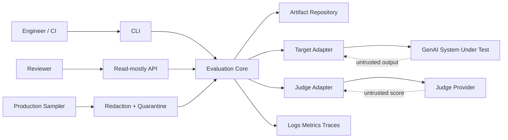
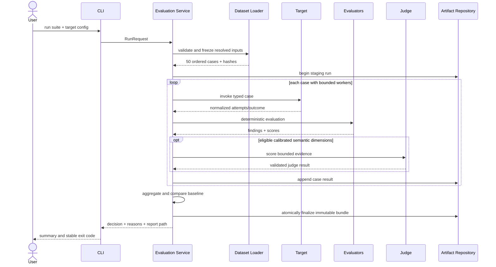
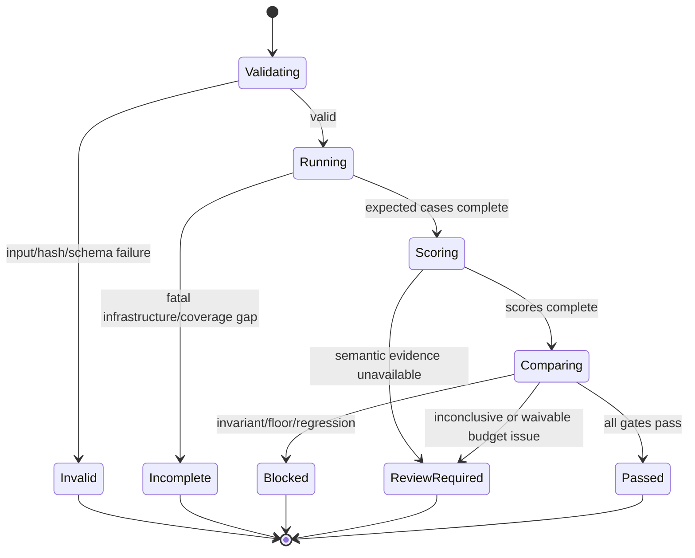

# High-Level Design

**Status:** PROPOSED_FOR_REVIEW

## 1. Context and trust boundaries



Inputs from datasets, targets, production, and judges are untrusted. The core owns validation, evaluation, gating, and artifact integrity. Adapters own transport translation, not scoring policy. CI owns deploy authorization but consumes the core's stable decision.

## 2. Component responsibilities

| Component | Owns | Must not own |
|---|---|---|
| Dataset loader | manifest/case validation, fixture containment, hashes | target calls or scores |
| Configuration loader | typed resolved target/evaluator/gate settings | secrets persisted into manifests |
| Runner | stable ordering, bounded concurrency, retries via policy, lifecycle | metric formulas or CI decisions |
| Target adapter | request translation and normalized outcome | case pass/fail policy |
| Deterministic evaluators | exact/profile metrics and hard invariant findings | provider transport |
| Judge service | eligibility, prompt/rubric, strict judge result, calibration lookup | overriding deterministic failures |
| Aggregator | case/profile/tag/operational summaries | baseline mutation |
| Regression engine | compatibility, thresholds, paired statistics, decision reasons | deployment or baseline selection |
| Artifact repository | atomic immutable run/baseline reads/writes | metric calculation |
| Report builder | JSON/JSONL/Markdown projections | independent evaluation logic |
| CLI/API | authentication/input/output contracts | duplicated business rules |
| Online sampler | consent, sampling, redaction, quarantine | automatic golden labels |

## 3. Offline run sequence



## 4. Artifact architecture

```text
artifact-root/
  runs/<run-id>/
    manifest.json
    attempts.jsonl
    cases.jsonl
    summary.json
    comparison.json
    report.md
    COMPLETE
  baselines/<suite-name>/<channel>.json
  calibrations/<rubric-id>/<version>.json
  waivers/<waiver-id>.json
```

Run files are written beneath a random staging directory, fsynced where supported, hashed, and atomically renamed. `COMPLETE` is written last and contains the bundle index hash. Readers ignore bundles without a valid marker. An object-store adapter uses the same “upload immutable objects, publish manifest last” rule. Baseline pointers are small reviewed mutable references to immutable run/config hashes; their history is retained by source control or store versioning.

## 5. Control flow and decisions



`Invalid` and `Incomplete` are run statuses, not quality decisions; their CLI exits prevent deployment. Only a comparable completed run can produce `PASS`, `BLOCK`, or `REVIEW_REQUIRED`.

## 6. Deployment topology

V1 local/CI mode runs as one process with bounded async target calls and filesystem artifacts. The optional service mode runs the same application services behind FastAPI, stores artifacts in a versioned object store, and uses the platform's existing job runner if long-lived asynchronous execution is needed. No bespoke queue or database is introduced in V1.

## 7. Extensibility model

Profiles extend three typed points: case expectation, normalized target evidence, and evaluator result. They do not replace dataset loading, runner lifecycle, artifact finalization, aggregation, comparison, or reporting. RAG, structured-output, and tool-use are first-party proof profiles, not a generic plugin marketplace.

## 8. Reliability and failure handling

- Safe transport retries are bounded exponential backoff with jitter and adapter-declared retryability.
- Target outputs and every attempt remain distinguishable; retry never overwrites evidence.
- Process interruption leaves a staging/incomplete run that cannot compare or promote.
- Judge failure preserves deterministic scores but produces review/non-comparable behavior according to required dimensions.
- Artifact integrity is verified on read; corrupt data never becomes a baseline.
- Rate-limit/concurrency settings are explicit config and recorded.
- Comparison requires exact case identity and compatible schema/evaluator policy.

## 9. Observability

Logs and traces correlate run, case, attempt, adapter, evaluator, and comparison without recording raw prompt/output by default. Metrics cover run outcomes, case states, failure classes, target/judge errors, latency, token/cost totals, hard-invariant breaches, baseline age, waiver use, and online quarantine. IDs with unbounded cardinality stay in logs/traces, not metric labels.

## 10. Security/privacy architecture

Secrets enter only adapter configuration at runtime. Redaction precedes telemetry and online persistence. Filesystem paths are resolved beneath approved roots. Report rendering escapes untrusted text. Target and judge credentials are separate. Service mode authenticates readers and restricts baseline/waiver mutation. Object storage uses encryption, versioning, retention, and least privilege. Synthetic goldens avoid making the test repository a sensitive-data store.

## 11. Alternatives considered

1. **Recommended: artifact-first shared core.** Small, reproducible, CI-native, easy to audit; central querying is limited until an index is needed.
2. **Database-first service.** Better concurrent search and dashboards; adds migrations, availability, and split-brain risk before V1 needs it.
3. **Adopt a hosted experiment platform.** Fast UI and comparisons; couples correctness and release policy to a vendor and complicates offline use.

V1 chooses option 1. The run bundle is deliberately exportable so option 2 or 3 can be added without rewriting evaluators.
