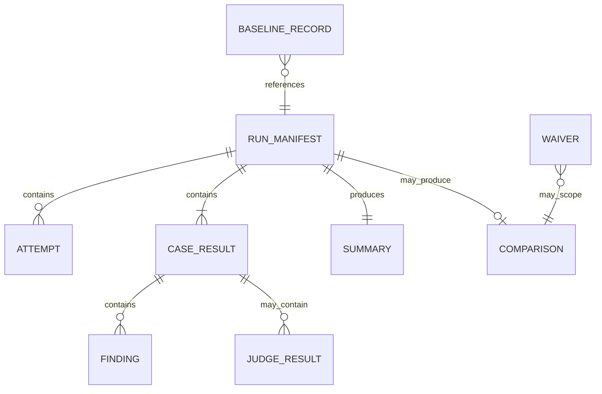

# Low-Level Design

**Status:** PROPOSED_FOR_REVIEW

## 1. Package boundaries

```text
src/eval_harness/
  domain/          # immutable models, metrics, findings, decisions
  datasets/        # load/validate/hash cases and fixtures
  adapters/        # target, judge, artifact-store implementations
  evaluators/      # text, safety, structured, RAG, tool-use
  application/     # run, replay, compare, promote, inspect services
  reporting/       # projections only
  cli.py           # argparse translation
  api.py           # FastAPI translation added in Phase 08
  observability.py
```

Dependencies point inward: CLI/API/adapters → application → domain. Profile evaluators depend on domain contracts. Domain imports no framework, provider SDK, filesystem, or environment configuration.

## 2. Core types

Conceptual signatures to lock during implementation:

```python
type JsonValue = None | bool | int | float | str | list["JsonValue"] | dict[str, "JsonValue"]

class Profile(str, Enum):
    TEXT_SEMANTIC = "text_semantic"
    SAFETY_ABSTENTION = "safety_abstention"
    STRUCTURED_OUTPUT = "structured_output"
    RAG = "rag"
    TOOL_USE = "tool_use"

class CaseState(str, Enum):
    PASS = "PASS"
    FAIL = "FAIL"
    INVALID = "INVALID"
    ERROR = "ERROR"
    REVIEW_REQUIRED = "REVIEW_REQUIRED"

class GateDecision(str, Enum):
    PASS = "PASS"
    BLOCK = "BLOCK"
    REVIEW_REQUIRED = "REVIEW_REQUIRED"

@dataclass(frozen=True)
class NormalizedOutcome:
    status: str
    text: str | None
    structured: JsonValue
    evidence: tuple["EvidenceHit", ...]
    citations: tuple["Citation", ...]
    tool_calls: tuple["ToolCall", ...]
    usage: "Usage"
    latency_ms: int
    raw_artifact_ref: str | None

@dataclass(frozen=True)
class Finding:
    evaluator_id: str
    code: str
    severity: str
    passed: bool
    score: float | None
    evidence: dict[str, JsonValue]
```

Stored contracts use Pydantic models with `extra="forbid"`; pure calculations accept immutable domain values. Exact model fields are finalized in Phases 01–04 and versioned as `eval.*.v1`.

## 3. Ports

```python
class TargetAdapter(Protocol):
    async def invoke(self, case: EvalCase, config: TargetConfig) -> AttemptResult: ...

class JudgeAdapter(Protocol):
    async def judge(self, request: JudgeRequest, config: JudgeConfig) -> JudgeResult: ...

class Evaluator(Protocol):
    @property
    def evaluator_id(self) -> str: ...
    def evaluate(self, case: EvalCase, outcome: NormalizedOutcome) -> tuple[Finding, ...]: ...

class ArtifactRepository(Protocol):
    def begin_run(self, manifest: RunManifest) -> RunWriter: ...
    def read_run(self, run_id: str) -> RunBundle: ...
    def read_baseline(self, suite: str, channel: str) -> BaselineRecord: ...
    def promote_baseline(self, record: BaselineRecord, authorization: PromotionAuthorization) -> None: ...
```

Only these ports justify interfaces because each has production and deterministic test implementations. Do not create repository interfaces for one pure function.

## 4. Dataset loading

1. Resolve the suite path beneath an approved root using `Path.resolve()` and containment checks.
2. Parse the manifest with strict size limits.
3. Verify `checksums.json`, suite content hash, case count, profile counts, and schema version.
4. Stream JSONL; reject blank/duplicate/unknown/oversized records.
5. Resolve fixtures beneath the suite root and verify checksums.
6. Return cases sorted by `case_id` plus a `DatasetIdentity`.

No Jinja, `eval`, dynamic import, shell expansion, remote fixture URL, or arbitrary Python hook is supported.

## 5. Invocation and retry

`AttemptResult` distinguishes `SUCCESS`, `TIMEOUT`, `RATE_LIMITED`, `TRANSPORT_ERROR`, `TARGET_ERROR`, and `MALFORMED_RESPONSE`. The adapter maps target data into `NormalizedOutcome` only after strict validation. Default maximum attempts are one; explicit adapter policies may allow up to three for read-only/idempotent requests. Every attempt records start/end, retry reason, HTTP/provider status where safe, usage, hashes, and redacted artifact reference.

Bounded concurrency preserves input ordering by assigning sequence numbers and emitting final results sorted by case ID. Rate-limiters and semaphores are process-local in V1; distributed coordination is deferred.

## 6. Evaluator dispatch

The registry is an explicit dictionary from `Profile` to a tuple of evaluator instances created in the composition root. Cross-cutting invariant evaluators run for all eligible outcomes before profile evaluators. Adding a first-party profile requires a new discriminated expectation model, evaluator, fixtures, report projection, and compatibility tests; it does not change the runner.

### Case pass algorithm

1. If invocation has no valid outcome, return `ERROR` with invocation finding.
2. Run hard-invariant evaluators; any failure makes the case `FAIL` and remains release-blocking.
3. Run required deterministic profile evaluators.
4. If a deterministic requirement fails, mark `FAIL`; judge calls that cannot change the result are skipped.
5. Run only required eligible semantic dimensions.
6. Missing/invalid/uncalibrated required semantic evidence returns `REVIEW_REQUIRED`.
7. All required dimensions passing returns `PASS`.

## 7. Metric edge semantics

- Scores are floats in `[0,1]` unless the metric contract states a rank/count/duration.
- `Recall@K` with no relevant labels is invalid for answerable retrieval cases; no-answer cases use no-answer metrics instead.
- `Precision@K` denominator is actual returned count capped at K; zero returned yields `0.0` for an answerable case.
- `MRR` is zero without a relevant hit.
- `nDCG` is omitted when labels are binary-only or ideal DCG is zero.
- Duplicate evidence identities count once at the earliest rank.
- Missing latency/usage is recorded unavailable and cannot satisfy a required budget.
- Floating comparisons use documented decimal tolerance only for serialization noise, not relaxed thresholds.

## 8. Run state and bundle schema



### `RunManifest`

`schema_version`, `run_id`, status, timestamps, command, dataset identity, target identity/config hash, evaluator/gate policy identity, judge/calibration identities, code/dependency/environment identities, redaction policy, requested/finished case IDs, nondeterminism/replicate policy, baseline identity, and bundle file hashes.

### `CaseResult`

Run/case/profile IDs, sequence, outcome hash/reference, attempts, findings, semantic scores, state, failure classes, latency/usage/cost, baseline transition, and redaction markers.

### `Summary`

Expected/completed/state counts, pass rate, profile/tag aggregates, invariant counts, metric aggregates, operational percentiles, judge availability, and comparability.

### `Comparison`

Candidate/baseline identities, compatibility checks, changed variables, paired case transitions, deltas/confidence intervals, threshold results, decision, ordered reason codes, and waiver reference.

### `BaselineRecord`

Suite/channel, immutable run and config hashes, gate-policy hash, approver identity, reason, creation time, superseded pointer hash, and optional signature.

## 9. Artifact publication

The filesystem writer creates `<run-id>.staging-<nonce>` with exclusive permissions, writes canonical UTF-8 JSON/JSONL, flushes and closes files, builds an index of hashes, writes `COMPLETE`, then atomically renames to `<run-id>`. Existing run IDs fail. Object-store publication uploads content-addressed objects and publishes the signed/hash-verified manifest last. Reports are projections and cannot be the only stored result.

## 10. Regression engine

`compare(candidate, baseline, gate_policy) -> Comparison` performs:

1. integrity and compatibility validation;
2. completion and expected-case coverage;
3. hard-invariant checks;
4. absolute overall/profile/contract floors;
5. per-case and per-profile baseline transitions;
6. paired semantic bootstrap with recorded seed;
7. latency and cost checks;
8. waiver validation for waivable reasons;
9. deterministic decision and ordered reason codes.

Decision priority is `BLOCK` over `REVIEW_REQUIRED` over `PASS`. A waiver suppresses only its exact eligible reason and never changes stored raw comparison results.

## 11. CLI contract

```text
eval-harness validate --suite PATH --config PATH
eval-harness run --suite PATH --config PATH [--case ID | --profile NAME | --tag TAG] [--baseline CHANNEL]
eval-harness replay --run RUN_ID
eval-harness compare --candidate RUN_ID --baseline CHANNEL
eval-harness inspect --run RUN_ID [--failures-only] [--format text|json]
eval-harness promote-baseline --run RUN_ID --suite NAME --channel NAME --reason TEXT --approval-file PATH
```

Common stdout is a compact summary; machine JSON is selected explicitly. Diagnostics go to stderr. Exit codes are `0 PASS/success`, `2 BLOCK`, `3 REVIEW_REQUIRED`, `4 invalid/non-comparable`, `5 infrastructure/internal error`, and `130 interrupted`. Partial selectors cannot promote a baseline or claim full-suite release eligibility.

## 12. HTTP API contract

### `POST /v1/runs`

Accepts suite/config identities and optional approved selector; returns `202` with `run_id`, `status`, and links. Idempotency key with same payload returns the original run; different payload conflicts.

### `GET /v1/runs/{run_id}`

Returns manifest-safe metadata, status, summary, decision, and report link; raw/sensitive artifacts require separate authorization.

### `GET /v1/runs/{run_id}/cases`

Supports bounded pagination and filters for profile/state/failure code. Returns redacted case results.

### `POST /v1/comparisons`

Compares completed compatible run/baseline identities and returns the stable comparison; no scoring logic exists in the route.

### `GET /v1/baselines/{suite}/{channel}`

Returns the current pointer and immutable promotion evidence.

### `POST /v1/baselines/{suite}/{channel}/promotions`

Restricted quality-owner action with run hash, reason, and approval evidence. Candidate execution identities cannot call it.

Errors use `{error: {code, message, retryable, correlation_id, details}}` and stable HTTP mappings. Health has separate liveness and artifact-store readiness.

## 13. Configuration

JSON configuration is strictly parsed. Environment variables provide secrets by named reference, never inline values persisted to artifacts. Material resolved values are redacted and hashed. Required sections: target, invocation, evaluators, judge, gate policy, artifacts, observability, privacy. Unknown keys fail. Defaults are documented and material defaults appear in the resolved run manifest.

## 14. Observability details

Structured fields: service/environment/version, run/case/profile, attempt, target/judge adapter, evaluator, state/failure code, baseline/channel, decision/reason, trace/span, latency bucket, token/cost availability, and redaction status. Metrics never label case ID, prompt, user, tenant, raw model, or arbitrary error text. Traces record hashes/references, not raw content.

## 15. Security controls

- authentication and role checks in API middleware/application authorization;
- protected baseline and waiver writes with audit evidence;
- path containment and symlink checks;
- JSON/document/output byte limits and nesting limits;
- no dynamic imports from data and no rendering of raw HTML;
- separate target/judge secret scopes and egress allow-lists;
- constant-time hash/signature verification where applicable;
- redaction before logs, reports, judge prompts, and online persistence;
- object-store encryption/versioning/retention in service mode;
- audit of reads for quarantined/sensitive artifacts.

## 16. Test seams

Use a deterministic fake target, recorded normalized outcomes, fake clock, injected random/bootstrap seed, temporary artifact root, and fake judge. Contract fixtures are shared with HTTP/provider adapters. No default test needs network, Docker, credentials, or paid calls. Integration tests use the real filesystem publication path; object-store tests use an approved emulator only when Phase 08 selects one.
