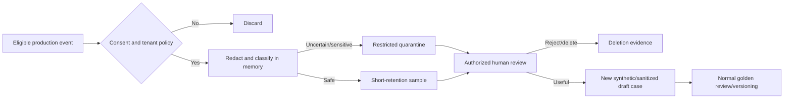

# Threat Model

**Status:** PROPOSED_FOR_REVIEW  
**Scope:** Dataset/config ingestion, target and judge boundaries, artifact persistence, CLI/API/CI control paths, baseline/waiver governance, telemetry, and online sampling.

## 1. Protected assets

- integrity of golden datasets, evaluators, thresholds, baselines, waivers, run bundles, and gate attestations;
- confidentiality of provider credentials, prompts, target outputs, production samples, human labels, and quarantined artifacts;
- availability of release evaluation and trusted artifact storage;
- authorization to promote baselines, approve waivers, read sensitive evidence, and deploy;
- traceability of which code/config/model/data produced a decision.

## 2. Trust boundaries

Dataset files, fixtures, target responses, retrieved evidence, citations, tool traces, judge responses, production samples, and user-supplied paths are untrusted. Candidate CI code is not trusted to choose the baseline or approve itself. Target and judge credentials have separate scopes. Artifact storage and protected base-branch policy are trusted only after authentication, authorization, version/hash verification, and audit evidence.

## 3. Threats and controls

| Threat | Example | Required controls | Verification |
|---|---|---|---|
| Dataset code/path execution | fixture uses `../`, symlink, template, or payload executable | containment, symlink checks, JSON-only data, no dynamic import/eval/template execution, size/nesting limits | malicious dataset tests |
| Prompt injection | RAG evidence tells target/judge to ignore rubric or reveal secrets | instruction/data separation, minimum evidence, strict output, canaries, no credentials in prompt | injection cases and judge contract tests |
| Baseline substitution | PR edits pointer or compares with its own easier run | trusted base-branch/store resolution, read-only candidate identity, signed/hash-bound attestation | adversarial CI fixture |
| Result tampering | case/report edited after run | immutable objects, manifest/checksum index, marker-last finalize, store versioning | corruption/replay tests |
| Gate bypass | deploy starts after skipped/review job | explicit dependency on verified current-commit `PASS` attestation | workflow policy test |
| Overbroad waiver | wildcard/permanent waiver hides regression | exact scope/reason, approved identity, <=14-day expiry, hard-invariant deny list | waiver boundary tests |
| Secret leakage | header/token appears in errors, logs, reports, judge prompt | secret references, separate scopes, redaction before sinks, canary scan, restricted raw artifact | redaction tests and scan |
| PII retention | production trace copied to golden or long-lived artifact | opt-in eligibility, pre-persist redaction, quarantine, classification, access log, retention/deletion | lifecycle/deletion drill |
| Unsafe target/tool effect | evaluation invokes real destructive tool | target sandbox/test tenant, allow-listed evaluation endpoint/tools, dry-run contract, least privilege | tool safety contract |
| Resource exhaustion | huge JSON/output, many retries, recursive nesting, slow target | byte/nesting/count/time limits, bounded concurrency/retries, rate/cost budgets | fuzz/limit/failure tests |
| Cross-tenant/evidence access | RAG hit or API result leaks another boundary | server-derived scope, evidence identity checks, authorization filters, hard invariant | isolation tests |
| Judge manipulation/drift | candidate text changes rubric behavior or provider alias changes | delimited data, frozen rubric/hash, strict schema, calibration/repeatability, exact identity evidence | injection/calibration tests |
| Malicious rendering | output injects HTML/terminal/log control codes | escape Markdown/HTML, safe terminal encoding, structured logs | report/log injection tests |
| Supply-chain compromise | dependency/container changes evaluator behavior | minimal dependencies, lock hashes, scans, provenance/SBOM policy, protected workflow | clean build and scans |
| Denial of service | provider/object store unavailable blocks release | bounded retry, explicit non-comparable state, preserved partial evidence, runbook | outage drills |

## 4. Privacy data flow

Raw samples do not enter general run artifacts, metrics labels, judge prompts, or golden repositories. Hashing/pseudonymization does not make high-entropy identifiers non-sensitive by itself.

## 5. Abuse cases that must block

- target exposes a secret canary;
- candidate invokes a forbidden/destructive tool;
- an accepted structured response violates its schema;
- citation identity is not in approved context;
- evidence/result crosses declared scope;
- baseline, bundle, gate policy, calibration, or attestation integrity fails;
- candidate identity attempts baseline/waiver/promotion mutation.

These are non-waivable in V1.

## 6. Residual risk

Human labels and calibrated judges can still be wrong; synthetic cases may miss production harms; authorized insiders can misuse permitted access; third-party providers can retain/process data under their own terms; hashes detect changes but do not prevent deletion or disclose origin authenticity without protected signing/identity. Deployment owners must select retention, encryption, identity, egress, incident, and vendor controls suitable for the real data classification.
