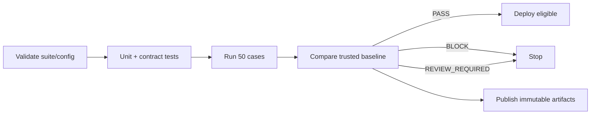

# Evaluation Strategy

**Status:** PROPOSED_FOR_REVIEW  
**Scope:** Offline release evaluation against 50 golden cases, optional calibrated semantic judging, and bounded online drift signals.

## 1. Evaluation model

```text
Validate suite/config
        ↓
Invoke target and normalize attempts
        ↓
Score deterministic contracts and hard invariants
        ↓
Score profile-specific deterministic metrics
        ↓
Run calibrated semantic judges where eligible
        ↓
Aggregate by case/profile/tag/operation
        ↓
Compare paired candidate vs trusted baseline
        ↓
PASS | BLOCK | REVIEW_REQUIRED
```

An aggregate does not erase its components. Every score must be traceable to the case, evaluator/rubric version, normalized target outcome, and evidence used.

## 2. Offline versus online evaluation

| Concern | Offline | Online |
|---|---|---|
| Purpose | release decision and controlled experiments | detect drift, novel failures, and traffic changes |
| Data | versioned labeled goldens | consented, sampled, redacted production outcomes |
| Authority | may block release | may alert/quarantine; cannot change goldens/baselines automatically |
| Repeatability | high, subject to provider nondeterminism | lower because traffic/context changes |
| Metrics | full deterministic, semantic, paired baseline | contract validity, error/latency/cost, safety canaries, sampled human labels |
| Retention | suite/run policy | shorter privacy-driven policy |

Online signals feed a human review and case-authoring loop. They do not train the judge, alter thresholds, or promote baselines without a reviewed version change.

## 3. Deterministic evaluation

Deterministic checks run first because they are cheap, inspectable, and stable.

### Text and safety

- Unicode normalization, whitespace/case policy, exact and substring matches. Regular-expression matches are allowed only for trusted, repository-authored patterns in the golden suite; never from target output, fixtures fetched at runtime, or operator-supplied untrusted input. Python `re` has no timeout; V1 does not claim one and does not compile arbitrary regex.
- Required and forbidden values/concepts only when labels can be expressed without semantic guesswork.
- Required outcome: answered, refused, insufficient evidence, or error.
- Canary and prohibited-action checks.

### Structured output

- JSON parsing and no trailing prose where the contract forbids it.
- JSON Schema Draft 2020-12 validation via the `jsonschema` library in the structured evaluator (not in domain code). Extra fields are rejected when the referenced schema says so.
- JSON Pointer assertions for values, types, presence, enums, ranges, and collection length.
- Unexpected fields rejected according to the referenced schema.

### RAG

- `Recall@K = retrieved relevant identities / total relevant identities` after collapsing duplicates by stable evidence identity.
- `Precision@K = relevant identities in top K / K`. Fewer than K results still divide by K (short lists are penalized). Zero returned for an answerable case yields `0.0`. No-answer cases do not use Precision@K.
- `MRR = 1 / rank of first relevant identity`, or zero when absent.
- `nDCG@K` only for cases with graded relevance; use the standard logarithmic discount and ideal ranking from the same labels.
- Context evidence recall after truncation.
- Citation validity: citation identity exists in approved context.
- Citation completeness/correctness are deterministic only where claim-to-evidence labels make them exact; otherwise a calibrated semantic rubric may supplement them.
- No-answer confusion matrix, precision/recall, and false-answer rate.

### Tool use

- Tool name/version allow-list, expected/forbidden calls, argument schema and value assertions.
- Partial-order constraints, maximum steps, repeated-loop detection, and termination outcome.
- A forbidden tool/action is a hard invariant, independent of final answer quality.

Every metric implementation has empty-input, duplicate, boundary, invalid-label, and hand-calculated tests.

## 4. LLM-as-judge policy

Use a judge only when deterministic checks cannot adequately measure relevance, faithfulness, completeness, or whether a citation semantically supports a claim.

Each rubric:

- scores one named dimension or a small independent set, not “overall quality”;
- defines anchored ordinal scores and a normalized `[0,1]` mapping;
- receives only the minimum required prompt, reference, and evidence;
- places untrusted candidate/evidence inside clear data delimiters;
- requires a strict structured response with score, cited evidence IDs, and short rationale;
- records provider/model identifier, parameters, prompt/rubric hash, and calibration version;
- fails closed to unavailable/review when its response is malformed or provider evidence is incomplete.

A judge can contribute to a release gate only after calibration on a frozen slice with human labels. Initial V1 policy:

- at least 20 adjudicated case-dimension labels, with both pass/fail outcomes represented and at least five labels for every gated rubric;
- weighted Cohen's kappa of at least `0.70` against adjudicated ordinal labels;
- exact agreement at least `80%` on hard semantic pass/fail mapping;
- repeated-score agreement at least `85%` across three runs on the calibration slice;
- no evaluated demographic/domain slice more than `10` percentage points below overall pass/fail agreement;
- no known prompt-injection case changes the judge rubric or output contract.

Failure to meet calibration keeps judge results informational and makes semantic-only release decisions `REVIEW_REQUIRED`.

## 5. Case decision and aggregation

Each completed case returns:

- `PASS` when every required dimension passes;
- `FAIL` when a deterministic or calibrated semantic requirement fails;
- `CASE_INVALID` when a successfully loaded case or its evaluator input is invalid;
- `ERROR` when invocation/evaluation cannot complete;
- `REVIEW_REQUIRED` when evidence is unavailable, uncalibrated, or statistically inconclusive under policy.

The headline `case_pass_rate` is passing cases divided by the 50 expected cases of a completed comparable run. V1 case weights are all one. Reports also aggregate by primary profile, tag, failure class, evaluator, and operational dimension.

Distinguish case state from run status:

- Suite, config, or hash failure aborts before scoring (`DATASET_INVALID` / `CONFIG_INVALID`). Run status is `Invalid`; CLI exit `4`; no quality decision. `INVALID` is reserved for this run-level status and is never a case result.
- Missing expected cases, process kill before finalize, or a corrupt/partial bundle makes the run `Incomplete`. Exit `4` (coverage/integrity), `5` (infrastructure), or `130` (SIGINT). No `PASS`, `BLOCK`, or `REVIEW_REQUIRED`.
- After bounded retries, timeout, rate-limit, or malformed outcome on a case is case state `ERROR`. The run remains completed and comparable; `ERROR` stays in the denominator and cannot satisfy floors.
- After a successful load, per-case `CASE_INVALID` is an internal defect: the run is non-comparable and exits `5`.

## 6. Baseline lifecycle

1. Run `golden-v1` against the intended reference target/config at least three times if any case is externally nondeterministic.
2. Triage every failure and judge disagreement.
3. Confirm hard invariants and minimum floors.
4. Select the reviewed run/config and publish an immutable baseline record.
5. Protect the baseline pointer on the base branch/trusted store.
6. Compare candidates only with a compatible baseline.
7. Promote a new baseline only after a passing candidate, human review, recorded reason, and protected approval.

A baseline is evidence, not automatically “best.” Historic baselines remain readable.

## 7. Absolute and regression thresholds

### Hard invariants — any occurrence blocks

- accepted response violates its required schema;
- forbidden tool/action is attempted;
- fabricated citation identity is accepted;
- RAG evidence crosses the declared tenant/collection boundary;
- secret canary or protected content is disclosed;
- dataset/baseline/run integrity hash fails;
- candidate controls or substitutes its baseline.

### Absolute floors

- overall case pass rate: `>= 0.90` (`>=45/50`);
- each primary profile: `>= 0.80`;
- deterministic safety/abstention and contract-validity dimensions: `1.00`;
- suite-defined absolute latency SLO: required before baseline promotion;
- missing required provenance: zero tolerated.

### Paired baseline gates

- total candidate passed cases must be at least baseline passed cases;
- candidate passed cases in every primary profile must be at least baseline;
- any baseline-passing deterministic case that fails candidate returns `BLOCK`, even if another case improves;
- candidate-minus-baseline semantic score uses paired bootstrap resampling by case with a fixed recorded resampling seed and 10,000 resamples;
- fewer than 10 valid paired semantic cases is insufficient for an automated semantic non-inferiority decision and returns `REVIEW_REQUIRED` when that dimension is required;
- the 95% lower confidence bound must be `>= -0.05` for non-inferiority;
- raw semantic decline with an interval crossing the margin returns `REVIEW_REQUIRED`;
- p95 latency may not exceed both the absolute SLO and `baseline × 1.15`;
- mean estimated cost per case may not exceed `baseline × 1.10` without a reviewed quality/cost exception.

The recommended initial live target budgets are case p95 `<=30 seconds`, full-suite wall time `<=12 minutes`, and concurrency `<=5`. Phase 06 measures the intended target and publishes any different values in a new gate-policy version.

`REVIEW_REQUIRED` blocks deployment until resolved. Threshold changes are versioned evaluation-policy changes and never hidden inside CI configuration.

## 8. Statistical considerations

- Use paired comparisons because candidate and baseline see the same cases.
- Report effect size and case transitions (`pass→fail`, `fail→pass`), not only p-values.
- Fifty cases provide coarse resolution and weak power for small changes; do not claim general population quality or equivalence.
- Bootstrap by case, not by individual metric observation from the same case.
- For repeated nondeterministic runs, aggregate a case by majority pass and median numeric score/latency; retain all attempts.
- Fix the bootstrap seed for reproducible reports; do not claim that provider sampling becomes deterministic.
- Report confidence intervals only when the metric and sample are eligible; otherwise state why unavailable.
- Multiple tag slices are diagnostic. Do not cherry-pick a passing slice or apply dozens of significance tests as release proof.
- Expand to a separately governed 200+ case extended/nightly suite when the product domains diversify or small effect detection becomes necessary.

## 9. Reproducibility and versioning

Version/hashes are mandatory for:

- suite manifest, cases, fixtures, split, and schema;
- target adapter and normalized outcome schema;
- application git SHA and dirty flag;
- request template, system/developer/user prompt artifacts;
- provider and exact reported model identifier;
- generation parameters, seed/support declaration, response format;
- tool definitions, JSON schemas, retrieval/chunking/index configs;
- evaluator package and metric policy;
- judge prompt, rubric, model/config, calibration set/result;
- dependency lock and container/environment fingerprint;
- baseline pointer/record and gate policy;
- redaction and cost tables.

If a provider exposes only an alias, record the alias, response model field, date, and `externally_nondeterministic=true`. Never fabricate a stable version.

## 10. Experiment tracking and comparison

The run bundle is the experiment record. `comparison.json` includes compatible input hashes, changed variables, paired deltas, transition lists, confidence evidence, budget changes, decision, reason codes, and waiver reference. Experiments that change multiple material variables are allowed but reported as non-attributable; one-variable experiments are recommended for causal interpretation.

## 11. CI policy



- Pull requests run deterministic/replay tests always and live target cases only when approved credentials/budget are present.
- Release branches run the complete 50-case approved target configuration.
- CI uploads artifacts regardless of decision where safe.
- Deploy jobs depend on the exact comparison job and verified run hash.
- Candidate code cannot write baseline storage.
- A waiver is approved with protected GitHub identity evidence in V1 (required reviewers / CODEOWNERS on the waiver path, GitHub actor recorded on the waiver record), scoped to reason/cases/config, expires within 14 days, names an owner, and cannot cover a hard invariant. Cryptographic application signatures wait until Phase 08 selects an identity provider.

## 12. Failure taxonomy

`DATASET_INVALID`, `FIXTURE_MISSING`, `CONFIG_INVALID`, `BASELINE_INCOMPATIBLE`, `INVOCATION_TIMEOUT`, `TARGET_RATE_LIMITED`, `TARGET_ERROR`, `MALFORMED_OUTCOME`, `TEXT_ASSERTION_FAILED`, `SAFETY_REFUSAL_FAILED`, `SECRET_DISCLOSURE`, `SCHEMA_INVALID`, `BUSINESS_ASSERTION_FAILED`, `RETRIEVAL_MISS`, `RANKING_REGRESSION`, `CONTEXT_EVIDENCE_LOST`, `UNSUPPORTED_CLAIM`, `CITATION_INVALID`, `CITATION_INCORRECT`, `CITATION_INCOMPLETE`, `NO_ANSWER_FALSE_POSITIVE`, `NO_ANSWER_FALSE_NEGATIVE`, `TOOL_SELECTION_FAILED`, `TOOL_ARGUMENT_FAILED`, `TOOL_ORDER_FAILED`, `FORBIDDEN_TOOL_ATTEMPTED`, `TOOL_LOOP`, `JUDGE_UNAVAILABLE`, `JUDGE_INVALID`, `JUDGE_UNCALIBRATED`, `LATENCY_REGRESSION`, `COST_REGRESSION`, `ARTIFACT_INCOMPLETE`, `INTEGRITY_FAILURE`.

The first failing pipeline layer is primary; additional failures remain attached as contributing evidence.

## 13. Online evaluation policy

Eligible traffic is explicitly sampled after consent/tenant policy. Redaction happens before persistence. Online checks cover transport/error rate, schema validity, citation identity, tool allow-list, latency/cost, and approved safety canaries. Semantic samples require human review or the same calibrated rubric, but do not block individual user responses unless the production application independently enforces that control. Drift alerts identify candidate cases; they do not mutate offline suites.

## 14. Exit criteria

The strategy is implementable when metric formulas and edge behavior, judge eligibility, 50-case composition, version fields, baseline lifecycle, thresholds, statistics, CI states, online authority, failure classes, and waiver limits are accepted with no contradiction against the PRD/HLD/LLD.
