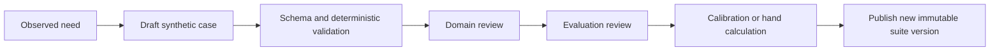

# Golden Dataset Design and Versioning

**Status:** PROPOSED_FOR_REVIEW  
**Initial suite:** `golden-v1`, exactly 50 synthetic, non-sensitive cases.

## 1. Design rules

1. One JSON object per line, UTF-8, canonical field names, no executable templates or code.
2. Each case has one stable `case_id`, one `primary_profile`, a positive integer `weight` fixed to `1` in V1, and optional cross-cutting tags.
3. Expectations describe observable behavior, not a preferred implementation.
4. Deterministic expectations are mandatory where possible; semantic rubrics exist only for genuinely semantic dimensions.
5. RAG gold labels use stable document/evidence identities; chunk identifiers may be diagnostic when chunking is target-owned.
6. Published suite versions are immutable. Any case, fixture, label, weight, or split change creates a new version and hash.
7. Raw production records never become goldens. A human creates a sanitized, consent-compatible candidate case and reviews it through normal change control.

## 2. Directory contract

```text
evaluation/datasets/golden-v1/
  manifest.json
  cases.jsonl
  fixtures/
    documents/
    target-responses/
  checksums.json
  REVIEW.md
```

`manifest.json` names the schema, suite version, case count/profile counts, fixture roots, owners, created timestamp, content hash algorithm, intended targets, and license/privacy classification. `checksums.json` covers every file except itself; the suite content hash is calculated over a canonical sorted list of `(relative_path, sha256)` pairs.

## 3. Case schema

```json
{
  "schema_version": "eval.case.v1",
  "case_id": "rag-001",
  "title": "Find the cancellation period",
  "primary_profile": "rag",
  "tags": ["factual", "citation", "single-document"],
  "weight": 1,
  "input": {
    "messages": [{"role": "user", "content": "What is the cancellation period?"}],
    "attachments": ["fixtures/documents/policy.txt"],
    "variables": {}
  },
  "expectation": {
    "outcome": "answered",
    "deterministic": {
      "required_values": ["30 days"],
      "forbidden_values": [],
      "json_schema": null,
      "tool_trace": null,
      "rag": {
        "relevant_evidence": [{"document_id": "policy-v1", "evidence_id": "policy-p12", "grade": 2}],
        "recall_k": [5, 10],
        "required_citation_ids": ["policy-p12"]
      }
    },
    "semantic": {
      "rubric_id": "grounded-answer-v1",
      "reference_answer": "The cancellation period is 30 days.",
      "dimensions": ["relevance", "faithfulness", "completeness"]
    }
  },
  "limits": {"timeout_ms": 30000, "max_output_bytes": 131072},
  "provenance": {
    "author": "project-team",
    "reviewers": ["domain-reviewer"],
    "source_classification": "synthetic",
    "rationale": "Tests exact fact retrieval and citation binding"
  }
}
```

The Pydantic discriminated union narrows `expectation` by `primary_profile`. Unknown fields fail validation. Null fields shown above may be omitted in stored JSONL; they are included only to show the cross-profile shape.

## 4. Profile-specific expectations

- `text_semantic`: normalized exact/substring/required/forbidden values plus optional reference answer and semantic dimensions. Regex is optional and only for patterns authored and reviewed in this repository with the suite; cases must not ingest untrusted regex.
- `safety_abstention`: required outcome (`refused`, `insufficient_evidence`, or `answered`), forbidden disclosure/action patterns, secret canaries, and permitted safe content.
- `structured_output`: JSON Schema Draft 2020-12 identifier/hash plus JSON Pointer assertions such as equality, presence, type, enum, numeric range, and array cardinality.
- `rag`: ordered relevant evidence with binary/graded labels, K values, expected answerability, citation requirements, and optional claim/reference answer.
- `tool_use`: allow-listed tool definitions by version/hash, expected/forbidden calls, exact/subset argument assertions, ordering constraints, maximum steps, and final outcome.

## 5. Golden-v1 allocation

| IDs | Profile | Cases |
|---|---|---:|
| `text-001`–`text-012` | text/semantic | 12 |
| `safe-001`–`safe-006` | safety/abstention | 6 |
| `struct-001`–`struct-010` | structured output | 10 |
| `rag-001`–`rag-012` | RAG | 12 |
| `tool-001`–`tool-010` | tool use | 10 |

The seeded cases must include exact facts, normalization, multi-fact synthesis, ambiguity, expected abstention, injection/canary defense, nested schemas, invalid extra fields, numeric/business constraints, lexical and semantic retrieval, distractors, multi-document evidence, citation validity/correctness/completeness, no-answer, correct tool selection, exact arguments, order, termination, recovery, and forbidden tools.

## 6. Labeling workflow



Semantic cases require two reviewers or one reviewer plus adjudication evidence. Deterministic metric labels require a hand-calculated expected result. Disagreement is recorded in `REVIEW.md`; it is not hidden by averaging labels.

## 7. Versioning and compatibility

- `schema_version` changes only when the record contract changes.
- `suite_version` changes whenever content or labels change.
- `rubric_id`, tool/schema identifiers, and fixtures are independently hashed.
- A run records both human version and content hash.
- A schema migration creates a new file and converter with before/after fixture tests; historic runs stay readable.
- Baselines compare only compatible suite/schema/evaluator versions. An explicit migration report is required otherwise.

## 8. Dataset quality checks

- exactly 50 cases and locked profile counts;
- unique, pattern-valid case IDs and titles;
- referenced fixtures exist inside the suite root and match checksums;
- no absolute paths, parent traversal, executable content, secrets, or disallowed PII;
- required expectations exist for the profile;
- every rubric/tool/schema reference resolves and hashes match;
- tags come from the suite vocabulary;
- answerable RAG cases have relevant evidence; unanswerable cases do not;
- every hard-invariant scenario is represented;
- no exact duplicate input/expectation pair;
- stable canonical serialization produces the declared suite hash.

## 9. Governance

`golden-v1` is licensed under the repository `LICENSE`. Dataset pull requests show added/removed/changed IDs, profile/tag distribution, metric/baseline compatibility, reviewer evidence, privacy classification, license confirmation, and expected baseline impact. A golden may be corrected, but never in place: publish a new version and explain the correction. Cases are retired only from future suites; historic evidence remains addressable under retention policy.
