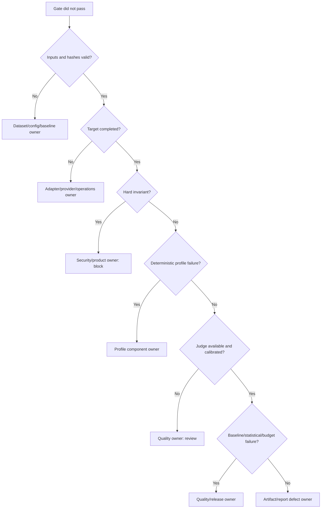

# Failure Triage and Operational Playbook

**Status:** PROPOSED_FOR_REVIEW

## 1. Triage principle

Start at the first failing pipeline layer. Do not tune prompts to hide dataset, invocation, retrieval, contract, or artifact failures.

## 2. Required failure record

Every non-pass records run/case IDs, first failing layer, failure code, candidate/baseline hashes, changed material variables, evaluator/rubric version, redacted evidence references, reproducibility status, severity, owner, disposition, and linked fix/waiver. Never copy secrets or unrestricted production content into tickets.

## 3. Response table

| Failure | Immediate action | Retry? | Owner |
|---|---|---|---|
| dataset/config/hash invalid | stop before target calls; repair versioned input | after correction | dataset/eval platform |
| target timeout/rate limit | retain attempts; apply bounded declared retry | only safe policy | adapter/operations |
| malformed target outcome | block/non-comparable; inspect adapter contract | after fix | adapter/application |
| hard invariant breach | block, quarantine sensitive evidence, security review | no blind retry | security/product |
| deterministic metric regression | inspect paired case and first failing evaluator | after candidate fix | owning feature team |
| judge unavailable/invalid | keep deterministic evidence; review/non-comparable | bounded safe retry | judge adapter/quality |
| judge drift/calibration failure | remove judge gate authority; human review | after recalibration | quality/domain |
| semantic non-inferiority inconclusive | block as review; inspect case transitions and repetitions | approved rerun | quality owner |
| latency/cost regression | verify usage/pricing/config, profile bottleneck | approved rerun | release/operations |
| partial/corrupt artifact | ignore incomplete bundle; preserve forensic staging | replay if inputs intact | eval platform |
| baseline mismatch/substitution | block and investigate trusted-source path | no | release/security |
| online PII/secret detected | quarantine, restrict access, invoke deletion/incident policy | no promotion | privacy/security |

## 4. Waiver policy

A waiver is allowed only for listed non-hard quality or operational reasons. It names exact suite/channel/reason codes/cases, owner, GitHub approver identity and approval evidence, justification, compensating control, and expiry no later than 14 days. An accepted waiver suppresses only its eligible reason codes and is visible in reports and telemetry. Hard invariants, integrity failures, candidate-controlled baselines, secret disclosures, forbidden actions, and cross-boundary evidence leakage are not waivable in V1. Default trusted baseline store: the artifact produced by the protected `promote-baseline` workflow; upgrade to the Phase 08 object store. Non-pass decisions skip the `deploy` job, which also re-verifies the attestation with `verify-attestation`.

## 5. Recovery drills

1. Kill the process after case results but before finalize: readers see no complete run; replay/restart is safe.
2. Corrupt one artifact byte: integrity validation fails and comparison/promotion refuses it.
3. Exhaust target rate limit: bounded retries stop, attempts persist, run cannot pass.
4. Return malformed judge JSON: deterministic findings persist and the required semantic dimension becomes review/non-comparable.
5. Change a baseline pointer from a candidate branch: trust verification blocks comparison/deploy.
6. Insert a secret canary in output: hard-invariant block and redaction/quarantine activate.
7. Lose shared artifact storage: service readiness fails; local completed bundle remains recoverable and no false pass is emitted.

## 6. Service objectives and alerts

Initial operational targets are validated in Phase 08: 100% complete-bundle integrity, 100% baseline promotions attributable, zero hard-invariant accepted releases, and deterministic replay agreement of 100%. Alert on run failure ratio, target/judge error spikes, artifact finalize failures, baseline age, expiring waivers, online quarantine, and any hard-invariant event. Avoid paging on individual expected candidate quality failures; route those to CI/review.
